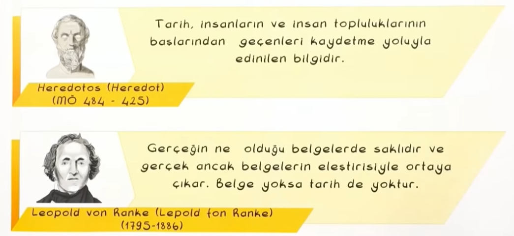
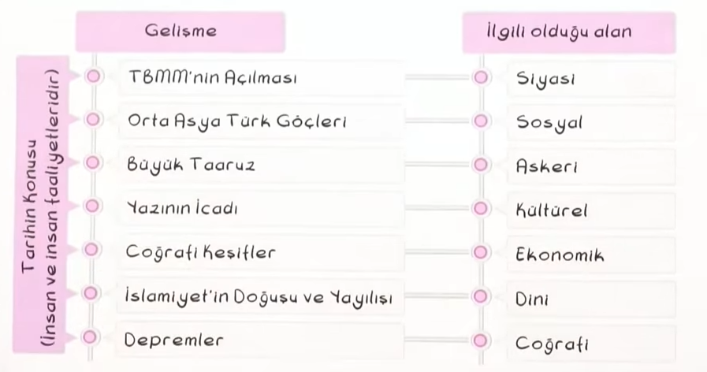
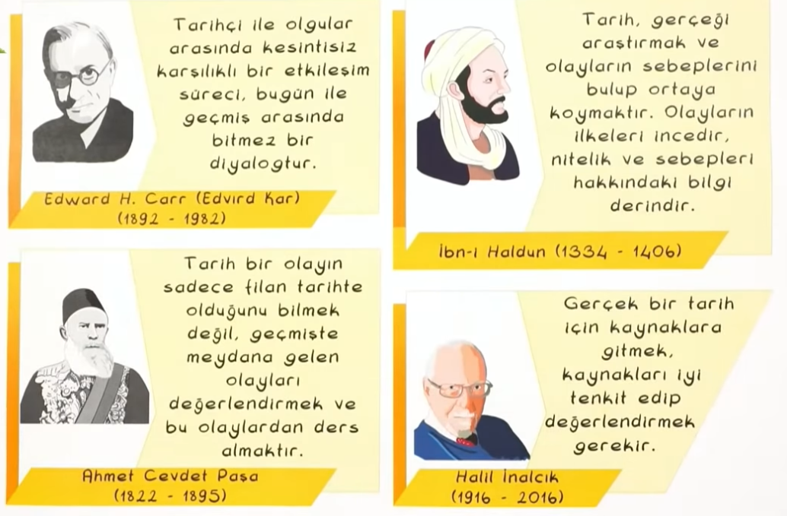
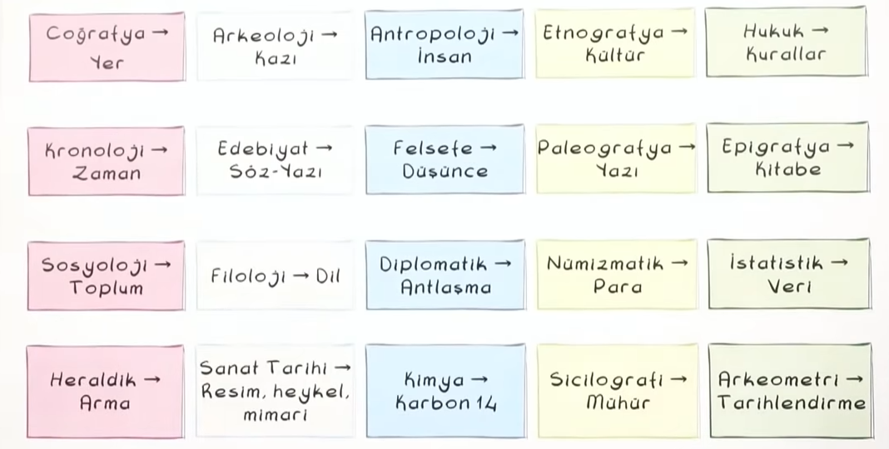
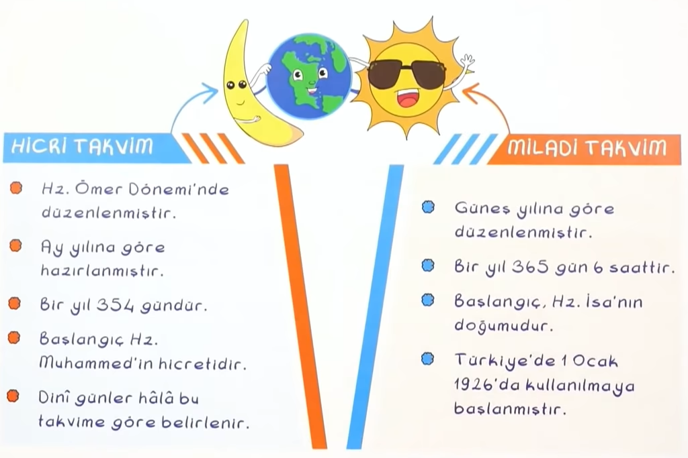
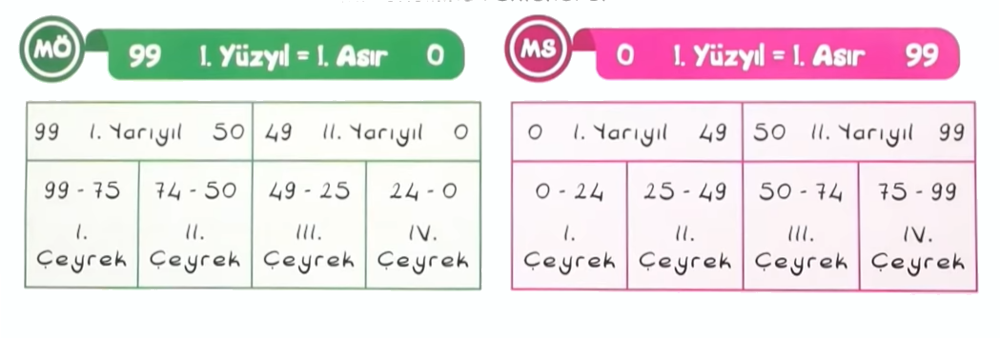

# Tarih ve Zaman

## Tarih Nedir?
* İnsanların ve olayların birbiri ile olan ilişkileri
* İnsanların geçmişteki her türlü faaliyetleri
* Yer ve zaman
* Sebep-sonuç ilişkisi
* Belgelere dayalı olarak inceleyen bilim dalı

 

## Tarihin Konusu
Zaman içinde yeryüzündeki insan faaliyetleri, farklı etkilerle meydana gelen değişimler ve insan eylemlerinin sonucunda ortaya çıkan eserler...

 

 

## Tarih Olay ve Olgu
**Olay** hayat ve içerisinde tek meydana gelen değişmeler...

<i>Örn:</i> [1071](https://tr.wikipedia.org/wiki/Malazgirt_Meydan_Muharebesi), [1176](https://tr.wikipedia.org/wiki/Miryokefalon_Muharebesi)

**Olgu** aynı türdeki olayları bir bütün olarak anlatmak için kullanılan kavram...

<i>Örn:</i> [Sömürgeciliğin başlaması](https://tr.wikipedia.org/wiki/S%C3%B6m%C3%BCrgecilik), [İslamiyet'in Türkler arasında yayılması](https://tr.wikipedia.org/wiki/T%C3%BCrklerin_%C4%B0slam%27a_ge%C3%A7i%C5%9Fi)
 

 

## Tarih Biliminin Özellikleri
- Tarihi bir olayın tekrar gerçekleşmesi mümkün değildir.
- Tarihte deney ve gözlem olmaz.
- Tarihi olayın meydana geldiği yer ve zaman bellidir.
- Tarihi olay belgelere dayanarak incelenir.
- Bir olayın sonucu başka bir olayın nedenidir.
- Geleceğe ışık tutar.
- Tarihi olayda hiçbir zaman kesinlik yoktur.

 

## Tarih Biliminin Yöntemi
<li><b>Tarama</b></li>
<ul>
	Bilgi ve verilerin bulunması
</ul>

<li><b>Tasnif (Sınıflandırma)</b></li>

<ul>
	Elde edilen bilgileri sınıflama
</ul>

<li><b>Tahlil (Çözümleme)</b></li>

<ul>
	Yeterliliği çözümleme
</ul>

<li><b>Tenkit (Eleştiri)</b></li>

<ul>
	Güvenirliliği tespit etme
</ul>

<li><b>Terkip (Sentez)</b></li>

<ul>
	Birleştirme
</ul>

 

## Tarihin Tasnifi (Sınıflandırılması)

### Zamana Göre
- Olaylar Kronolojik dilimlere veya çağlara bölünerek incelenir. Orta Çağ, XI. Yüzyıl vb.

### Mekana Göre
- Kıtalara, ülkelere, şehirlere göre yapılan sınıflandırmasıdır. Asya tarihi, Türkiye tarihi, Adana tarihi vb.

### Konuya Göre
- Siyasi, dini, ekonomik yönler ele alınarak yapılan sınıflandırmalardır. Sanat tarihi, dinler tarihi vb.

 

## Tarihin Kaynakları
### Birinci Elden Kaynak (Ana Kaynak):

<ul>
	Olayın geçtiği döneme ait eserler. Kitabe, abide, arkeolojik buluntu, para vb.
</ul>

### İkinci El Kaynaklar:

<ul>
	Olayın geçtiği döneme yakın ya da o dönem kaynaklarından faydalanılarak meydana getirilen eserlerdir.
</ul>

1. **Yazılı Kaynaklar:** Ferman, mühür, para, gazete, hatıra vb.

2. **Sözlü Kaynaklar:** Destan, efsane, hikâye, şiir vb.

3. **Kalıntılar:** Arkeolojik buluntular; taş, toprak, kemik, madenden yapılmış eşyalar, mezarlar vb.

4. **Çizili, sesli ve görüntülü kaynaklar:** CD, film, fotoğraf, resim vb.

 

## Tarihin Biliminin Diğer Bilimlerle İlişkisi

 

 

## Neden Tarih?

### Tarih Bilimi Bize Ne Kazandırır?

- <b>Araştırma</b> ve kanıt kullanma becerisi
- <b>Eleştirel</b> düşünme, sorgulama ve empati becerisi
- Çok boyutlu düşünme yeteneğimizi geliştirme
- Geçmişimizi öğrneme
- Günümüzü anlama, geleceğe yönelik planlar yapma

 

## Tarihi Olaylara Bakış Açısı
Tarihi olaylar ele alınırken tarihi bilgilerin kendi döneminin şartlarına göre değerlendirilmesi gerekir.

Eğer bir tarihi olay ele alınırken kendi döneminin şartlarına göre değerlendirilmezse bu [anakronizm](https://tr.wikipedia.org/wiki/Anakronizm) olur.

#

İnsanlar, günlük yaşamlarını kolaylaştırmak için zamanı bölümlere ayırmışlardır. Her Toplum kendine özgü bir takvim oluştururken yaşamlarını en çok etkileyen olayları takvimlerinin başlangıcı kabul etmişlerdir.
&nbsp;
<i>"Takvimi nasıl tarif etsem?"</i>
&nbsp;
"Takvim" zamanı "çağ, yıl, ay, hafta, gün" şeklinde dilimlere bölmeye yarayan bir çizelgedir.
&nbsp;
<i>"Ne işe yarar bu takvim?"</i>
&nbsp;
"Zaman" ya da "vakit" insan için çok önemlidir. Bu çok değerli sermayeyi en güzel şekilde kullanabilmek için zamanı ölçümlemek ve vakti organize edip buna göre hayatı düzenlemek önemlidir. İşte bu noktada takvim, saat gibi araçlar insanın hayatında önem kazanır

 

## 12 Havanlı Türk Takvimi
- 1 yıl 365 gün, 5 saat olarak kabul edilmiştir.
- 12 yılda 1 devreder.
- Yıllar sayı ile değil, hayvan adlarıyla gösterilir.
- Aylar, sayılarla belirtilir.
- Bu takvim Türklerden başka Çinliler ve Tibetliler tarafından da kullanılmıştır.

 

## Hicri Takvim
- Bir yıl 354 gündür.
- Kameri (ay yılı esastır) takvim olarak da bilinir.
- Hz.Muhammed'in Mekke'den Medine'ye hicretini (622) başlangıç yılı olarak esas almıştır.
- Hz.Ömer Dönemi'nde oluşturulmuştur.
- Ülkemizde 1 Ocak 1926'ya kadar yürürlükte olan bu takvim, günümüzde sadece dini ay ve günlerin belirlenmesinde kullanılmaktadır.

 

## Celali Takvim
- Bir yıl 365 gün 6 saat olarak kabul edilmiştir.
- Büyük Selçuklu Sultanı Melikşah tarafından hazırlanmıştır.
- Takvimin başlangıç tarihi olarak 1079 yılı kabul edilmiştir.
- Babür devleti tarafından da kullanılmıştır.

 

## Rumi Takvim
- Bir yıl 365 gün 6 saat olarak kabul edilmiştir.
- Gündelik hayatta hicri takvim kullanılırken 1839 yılından itibaren Osmanlı Devleti'nde mali işlerde (vergi, maaş vb.) aksama olmaması için kullanılmıştır.

 

## Miladi Takvim
- Bir yıl 365 gün 6 saat olarak kabul edilmiştir.
- Gregoryen takvimi olarak da bilinir. Başlangıç olarak Hz.İsa'nın doğum yılı kabul edilmiştir.
- İlk şekli olan Güneş takvimi Mısırlılara aittir. Romalılar ve Papa XIII.Gregorious tarafından geliştirilmiştir.
- Hz.İsa'nın doğumu takvim başlangıcı olarak kabul edildiğinden bu takvime Miladi takvim adı verilmiştir.
- Ülkemizde 1 Ocak 1926'dan itibaren kullanılmaya başlanmıştır.

  

 

## Yüzyıl Hesaplamaları Nasıl Yapılır?

Dört rakamlı bir tarihin ilk iki rakamına 1 eklenerek kaçıncı yüzyıl olduğu bulunur.
&nbsp;

Eğer milattan öncesini bulmak istiyorsak öncelikle Yüzyılı bulmamız gerekiyor:

 

*1879 = M.Ö 19.Yüzyıl*

 

Kaçıncı yüzyıl olduğunu bulduktan sonra kaçıncı yarı yıl olduğunu buluyoruz:

 

*1879 = M.Ö 19.Yüzyılın 1.Yarısı*

 

Kaçıncı yarıyıl olduğunu da bulduktan sonra en son olarak kaçıncı çeyrekte olduğunu buluyoruz:

 

*1879 = M.Ö 19.Yüzyılın 1.Yarısının 1.Çeyreği*

 

İşte bu kadar basit! Tam tersi de M.S (Milattan Sonrası) için geçerli, örneğin:

 

*2020 = M.S 21.Yüzyıl
2020 = M.S 21.Yüzyılın 1.Yarısı
2020 = M.S 21.Yüzyılın 1.Yarısının 1.Çeyreği*
 

<i>Son</i>
